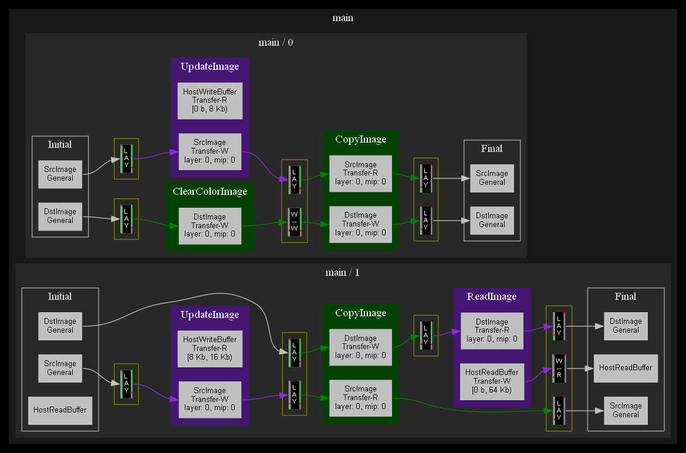

Graph visualization contains:
* Initial and final state of all resources that will be used in current subbatch.
* All pipeline barrier that automaticaly placed between tasks.
* All tasks with default or custom name and color.
* Synchronizations and memory transfer between host and device.

To set task name and color use `SetName()` and `SetDebugColor()`.

Use `FrameGraphInstance::DumpToGraphViz` to retrive graph description in dot-language. 
Or use [GraphViz helper library](../extensions/graphviz) to retrive and visualize graph with graphviz (should be installed).

Example:

