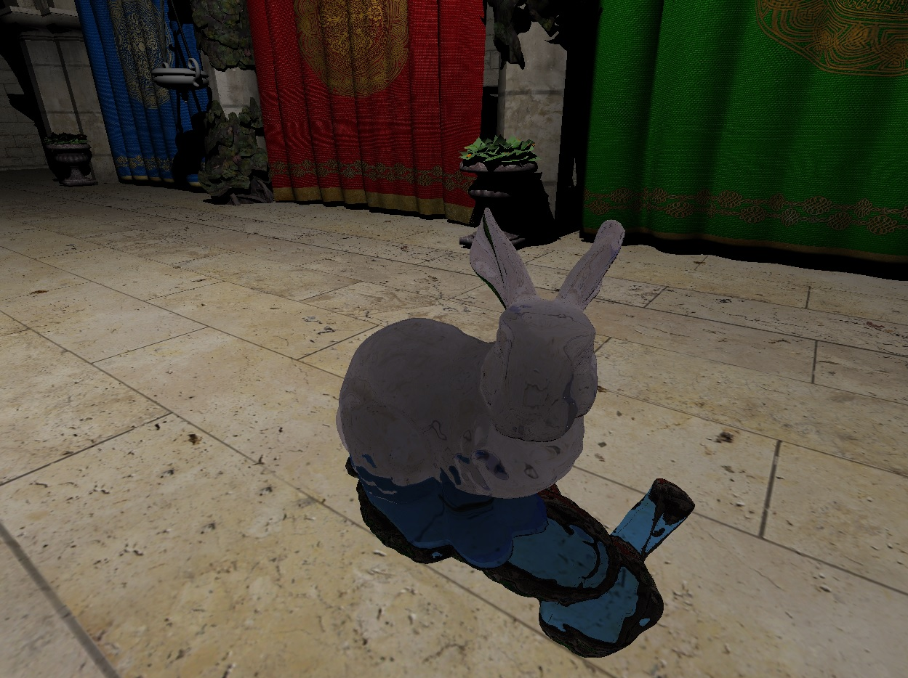

# Samples

## Ray tracing
Experiments with ray tracing extension.

## Shadertoy
Some shaders from [Shadertoy](https://www.shadertoy.com).

## Vulkan samples
Here are some prototypes of new features written on a pure Vulkan API before they are added to FrameGraph.
* Async compute
* Performace tests: Clear image, Generate mipmaps
* Ray tracing extension (Nvidia only)
* Sparse image
* Shading rate image extension (RTX only)
* Mesh shader extension (RTX only)
* Image footpring extension (RTX only)
* Fragment shader barycentric extension (RTX only)
